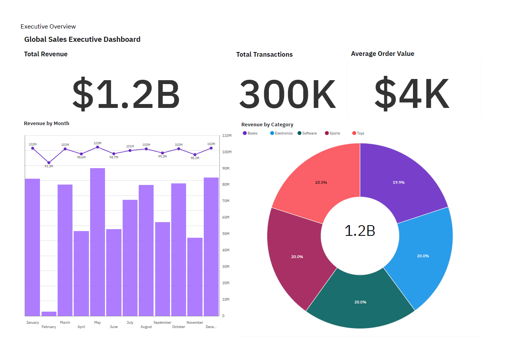
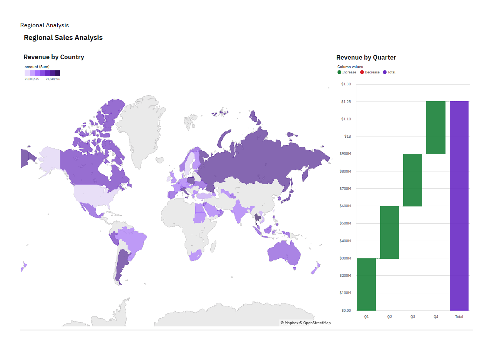
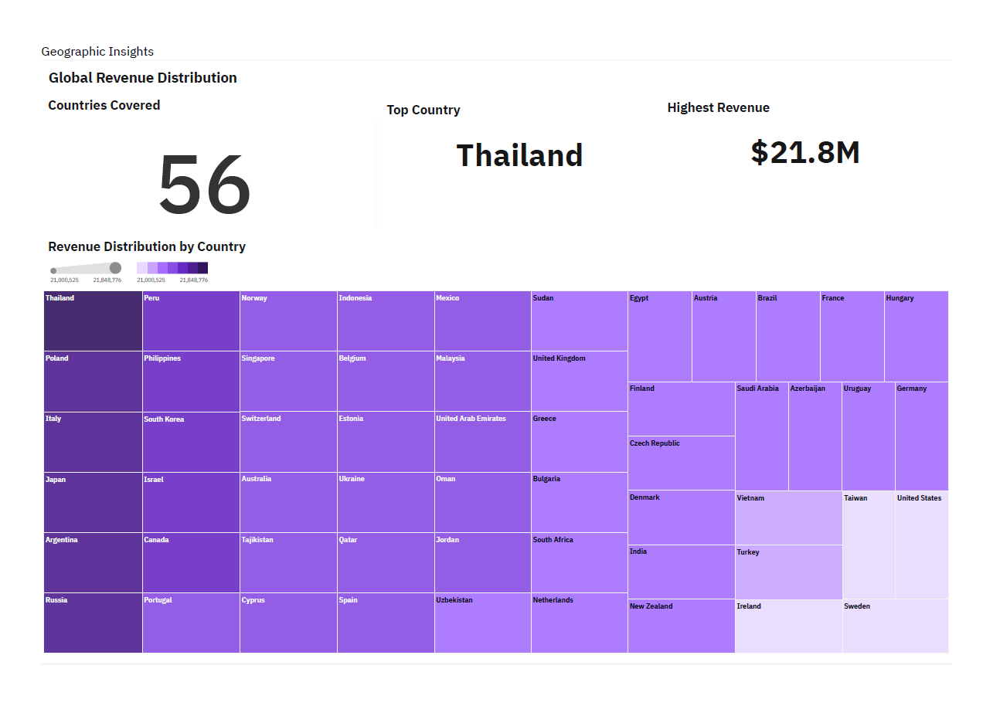
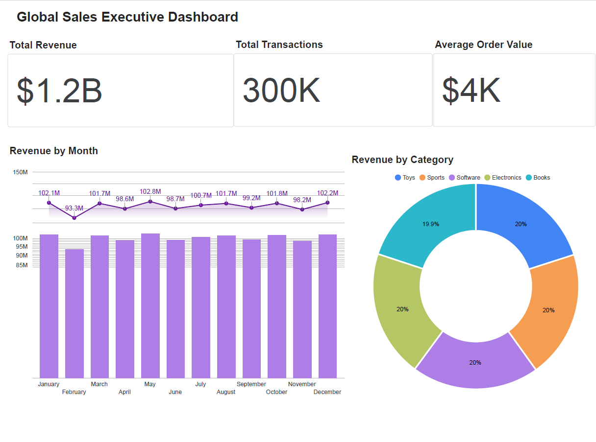
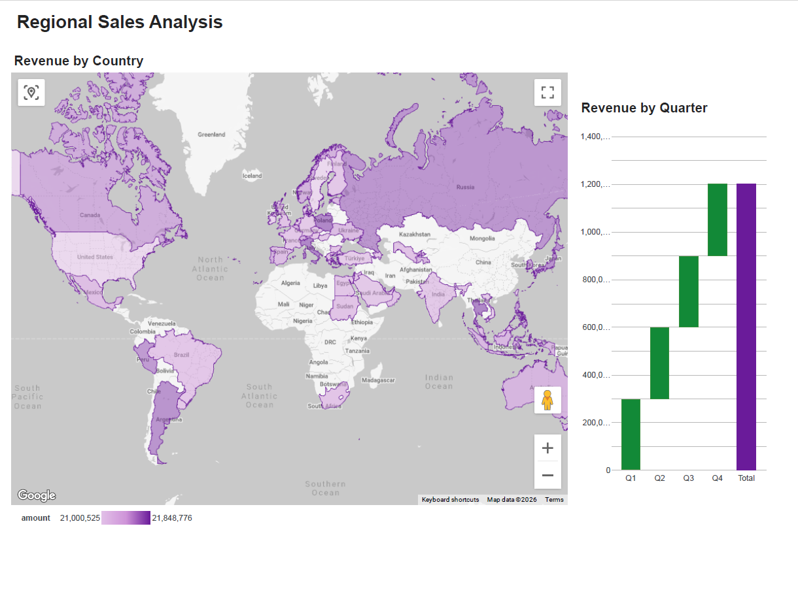
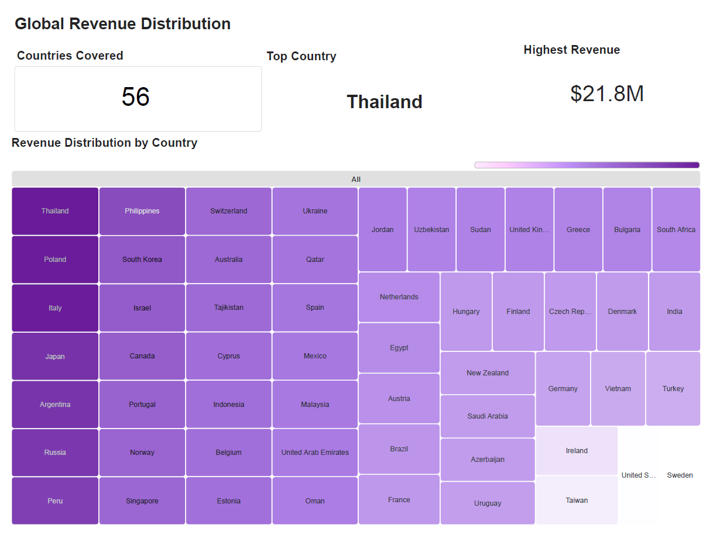

# Module 7 – BI Analytics & Executive Dashboards

## 📌 Module Overview
This module demonstrates the development of Business Intelligence dashboards and analytical reporting solutions using IBM Cognos Analytics and Google Looker Studio.

The dashboards were built on top of the PostgreSQL Data Warehouse developed in Module 2 using dimensional modeling and star schema relationships.

The module focuses on transforming structured warehouse data into executive-level business insights through interactive visualizations, KPI reporting, and geographic analytics.

---

## 🎯 Objectives
- Build executive-level BI dashboards
- Visualize business performance metrics
- Analyze revenue trends and geographic distribution
- Implement dimensional relationships for analytics
- Demonstrate cross-platform BI capabilities
- Create interactive reporting solutions

---

## 🛠 Tools & Technologies
- IBM Cognos Analytics
- Google Looker Studio
- PostgreSQL
- Star Schema Modeling
- Fact & Dimension Tables
- CSV Data Integration
- Business Intelligence Reporting

---

## 🏗 BI Architecture

The BI layer was built on top of the PostgreSQL Data Warehouse developed in Module 2.

The workflow included:
- dimensional modeling in PostgreSQL
- validation of dimensional relationships in pgAdmin
- dashboard development in IBM Cognos Analytics
- blended data modeling in Google Looker Studio
- executive reporting and PDF export

---

## 📁 Module Structure
```text
module_7_bi_analytics/
├── README.md                                   → Module documentation and dashboard overview
│
├── cognos/
│   ├── dashboards/
│   │   └── Global_Sales_Insights_Dashboard.pdf → IBM Cognos dashboard export
│   │
│   └── screenshots/
│       ├── cognos_relationships.png            → Cognos dimensional relationship modeling
│       ├── cognos_dashboard_overview.png       → Executive KPI dashboard overview
│       ├── cognos_regional_analysis.png        → Regional sales and quarterly revenue analysis
│       └── cognos_geographic_insights.png      → Geographic revenue distribution and treemap analytics
│
├── looker_studio/
│   ├── dashboards/
│   │   └── Global_Sales_Insights_Dashboard.pdf → Looker Studio dashboard export
│   │
│   └── screenshots/
│       ├── looker_blend_data.png               → Looker Studio blended data configuration
│       ├── looker_join_configuration.png       → Join and merge configuration
│       ├── looker_dashboard_overview.png       → Executive KPI dashboard overview
│       ├── looker_regional_analysis.png        → Regional sales and quarterly revenue analysis
│       └── looker_geographic_insights.png      → Geographic revenue distribution and treemap analytics
│
└── data_model/
    └── relationships.png                       → PostgreSQL star schema relationships
```

## 🧠 Data Model Architecture

The dashboards were developed using a dimensional star schema model created in PostgreSQL.

### Fact Table
- `FactSales`

### Dimension Tables
- `DimDate`
- `DimCountry`
- `DimCategory`

The relationships between fact and dimension tables were implemented and validated in:
- PostgreSQL / pgAdmin
- IBM Cognos Analytics
- Google Looker Studio

---

## 📊 Dashboard Features

### Executive KPI Overview
- Total Revenue
- Total Transactions
- Average Order Value

### Revenue Analysis
- Revenue by Month
- Revenue by Quarter
- Revenue by Product Category

### Geographic Insights
- Revenue by Country
- Global Revenue Distribution
- Top Revenue Country Analysis

### BI Modeling Features
- Star schema relationships
- Blended datasets
- Dimensional joins
- Cross-platform BI implementation

---

## 📈 IBM Cognos Analytics

IBM Cognos Analytics was used to create enterprise-style executive dashboards with dimensional relationships and analytical reporting capabilities.

### Implemented Features
- Relationship modeling
- KPI cards
- Revenue trend analysis
- Geographic visualizations
- Treemap analytics
- Quarterly revenue analysis

### Included Files
- [`Global_Sales_Insights_Dashboard.pdf`](cognos/dashboards/Global_Sales_Insights_Dashboard.pdf)
- [`cognos_relationships.png`](cognos/screenshots/cognos_relationships.png)
- [`cognos_dashboard_overview.png`](cognos/screenshots/cognos_dashboard_overview.png)
- [`cognos_regional_analysis.png`](cognos/screenshots/cognos_regional_analysis.png)
- [`cognos_geographic_insights.png`](cognos/screenshots/cognos_geographic_insights.png)

---

## 🌐 Google Looker Studio

Google Looker Studio was used to build cloud-based interactive dashboards using blended datasets and analytical visualizations.

### Implemented Features
- Data blending
- Join configuration
- KPI reporting
- Interactive maps
- Revenue trend visualization
- Geographic distribution analytics

### Included Files
- [`Global_Sales_Insights_Dashboard.pdf`](looker_studio/dashboards/Global_Sales_Insights_Dashboard.pdf)
- [`looker_blend_data.png`](looker_studio/screenshots/looker_blend_data.png)
- [`looker_join_configuration.png`](looker_studio/screenshots/looker_join_configuration.png)
- [`looker_dashboard_overview.png`](looker_studio/screenshots/looker_dashboard_overview.png)
- [`looker_regional_analysis.png`](looker_studio/screenshots/looker_regional_analysis.png)
- [`looker_geographic_insights.png`](looker_studio/screenshots/looker_geographic_insights.png)

---

## 📷 Dashboard Previews

### IBM Cognos Analytics – Executive Overview
**[View Dashboard PDF]**(cognos/dashboards/Global_Sales_Insights_Dashboard.pdf)



### IBM Cognos Analytics – Regional Analysis


### IBM Cognos Analytics – Geographic Insights


---

### Google Looker Studio – Executive Overview
**[View Dashboard PDF]**(looker_studio/dashboards/Global_Sales_Insights_Dashboard.pdf)



### Google Looker Studio – Regional Analysis


### Google Looker Studio – Geographic Insights


---

## ▶ Execution Workflow

1. Build dimensional tables in PostgreSQL
2. Create star schema relationships
3. Export warehouse tables into CSV format
4. Import datasets into BI platforms
5. Configure joins and relationships
6. Develop executive dashboards
7. Create KPI visualizations and geographic analytics
8. Export dashboards into PDF format

---

## ✅ Module Outcome
- Enterprise-style executive BI dashboards successfully developed
- PostgreSQL dimensional warehouse integrated with BI platforms
- Star schema relationships implemented and validated
- Interactive executive KPI reporting created
- Geographic and revenue analytics visualized
- Cross-platform Business Intelligence architecture and executive analytics capabilities demonstrated
