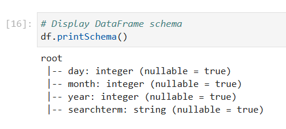
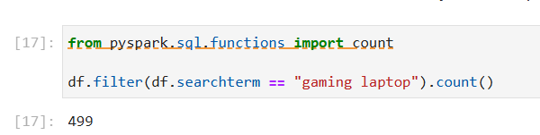
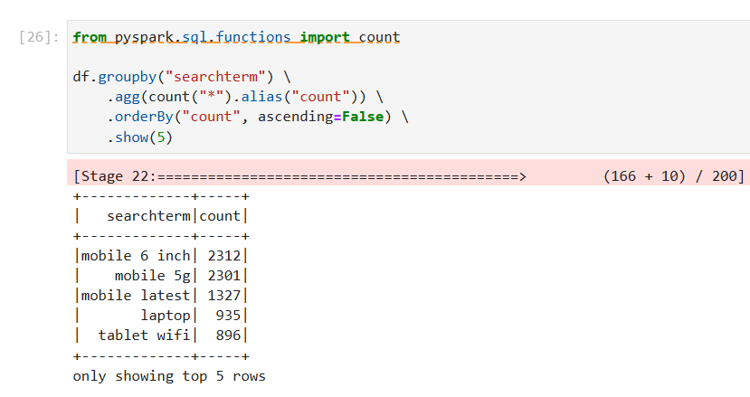
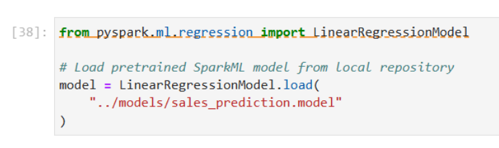
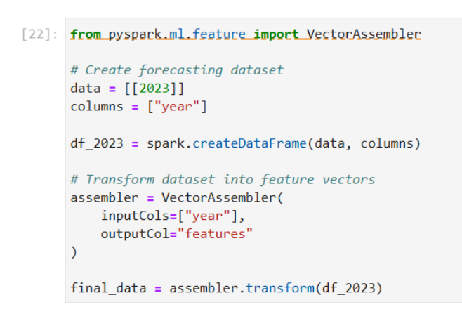
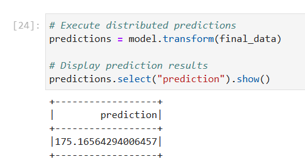

# Module 8 – Big Data Processing & ML Analytics with Apache Spark

## 📌 Module Overview
This module demonstrates distributed data processing, analytical querying, and machine learning inference using Apache Spark.

The module focuses on analyzing web server search term data from an e-commerce platform and deploying pretrained machine learning models for predictive sales forecasting.

Apache Spark was used to process structured datasets, execute distributed analytical operations using Spark DataFrames, and run ML prediction workflows in a distributed computing environment.

---

## 🎯 Objectives
- Analyze web server search term data using Apache Spark
- Load and process CSV datasets with Spark DataFrames
- Perform distributed analytical queries
- Deploy pretrained machine learning models
- Execute ML inference and sales forecasting
- Demonstrate distributed data processing workflows

---

## 🛠 Tools & Technologies
- Apache Spark
- PySpark
- Spark DataFrames
- Machine Learning Inference
- Distributed Data Processing
- CSV Data Processing
- Jupyter Notebook
- Python
- ML Model Deployment

---

## 🏗 Big Data Architecture

The workflow demonstrates distributed analytics and ML inference using Apache Spark.

The pipeline included:
- CSV dataset ingestion
- Spark DataFrame creation
- distributed analytical processing
- search term analytics
- pretrained ML model loading
- distributed prediction execution
- future sales forecasting

---

## 📁 Module Structure
```text
module_8_big_data_spark/
├── README.md                                          → Module documentation and workflow overview
│
├── notebooks/
│   ├── spark_big_data_predictive_analytics.ipynb      → Distributed analytics and sales forecasting workflow
│   └── distributed_sparkml_model_workflow.ipynb       → SparkML training, persistence, and inference workflow
│
├── datasets/
│   └── searchterms.csv                                → E-commerce web server search term dataset
│
├── models/
│   ├── sales_prediction.model/                        → Pretrained sales forecasting SparkML model
│   │   ├── data/
│   │   └── metadata/                                  
│   │
│   ├── infantheight2.model/                           → Infant height-to-weight regression model
│   │   ├── data/
│   │   └── metadata/                                  
│   │
│   └── babyweightprediction.model/                    → Saved SparkML prediction model for inference workflows
│       ├── data/
│       └── metadata/                                  
│
└── screenshots/
    ├── spark_schema.png                               → Spark DataFrame schema inference
    ├── search_frequency_analysis.png                  → Search frequency analytical query
    ├── top_search_terms.png                           → Top searched product terms aggregation
    ├── sparkml_model_loading.png                      → SparkML model deployment and loading
    ├── forecast_dataset_preparation.png               → Feature vector preparation for forecasting
    ├── distributed_prediction_results.png             → Distributed sales forecasting predictions
    ├── sparkml_dataset_creation.png                   → SparkML training dataset creation
    ├── feature_vector_transformation.png              → VectorAssembler feature engineering workflow
    ├── sparkml_model_training.png                     → Linear Regression model training process
    └── distributed_inference_results.png              → Distributed SparkML inference results

```

## 🧠 Spark Workflow

```text
CSV Dataset
     ↓
Spark DataFrame
     ↓
Distributed Analytics
     ↓
Search Term Analysis
     ↓
Pretrained ML Model Loading
     ↓
Distributed ML Inference
     ↓
Sales Forecasting Predictions
```

## 📊 Search Term Analytics

Web server search term data was processed using Spark DataFrames to analyze search behavior and query frequency.

### Analytical Operations
- CSV ingestion into Spark
- Spark DataFrame creation
- Data exploration and filtering
- Aggregation and analytical queries
- Search term analysis

### Dataset
- `searchterms.csv`

---

## 🤖 Machine Learning Inference

Pretrained machine learning models were deployed and executed using Apache Spark.

### Workflow Components
- model loading
- distributed prediction execution
- future sales forecasting

### Implemented Features
- ML model deployment
- Spark ML inference
- distributed prediction processing
- predictive analytics workflows
- future sales forecasting

---

## 📈 Sales Forecasting

The pretrained sales forecasting model was used to generate predictions for future sales periods.

### Prediction Workflow
1. Load pretrained ML model
2. Initialize Spark environment
3. Execute distributed predictions
4. Generate future sales forecast output

### Prediction Capabilities
- Distributed ML inference
- Forecast generation
- Predictive analytics
- Spark-based ML execution

---

## 📷 Workflow Preview

### Spark Schema Inference


### Search Frequency Analytics


### Top Search Terms Aggregation


### SparkML Model Loading


### Feature Engineering for Forecasting


### Distributed Prediction Results


---

## ▶ Execution Workflow

1. Initialize Apache Spark environment
2. Load CSV dataset into Spark DataFrame
3. Execute analytical queries on search term data
4. Load pretrained ML models from the local repository
5. Initialize distributed ML inference workflows
6. Execute distributed prediction workflows
7. Generate future sales forecasting output
8. Validate analytical and prediction results

---

## ✅ Module Outcome
- Distributed analytics successfully executed using Apache Spark
- Web server search term data analyzed with Spark DataFrames
- Pretrained ML models successfully loaded and deployed
- Distributed ML inference workflows implemented
- Sales forecasting predictions generated for future periods
- Big Data processing and predictive analytics capabilities demonstrated
