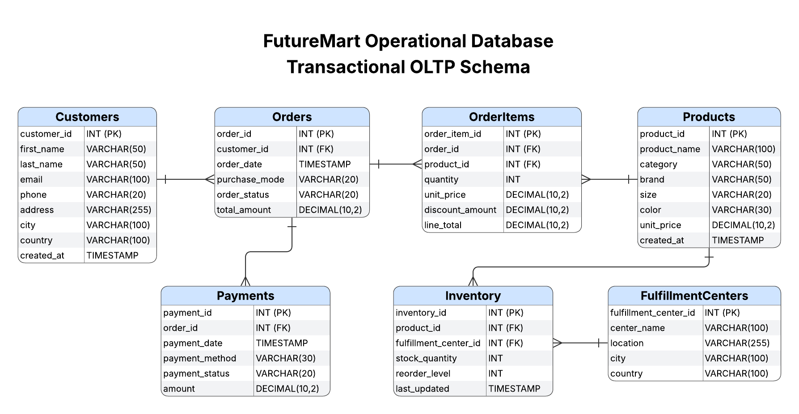
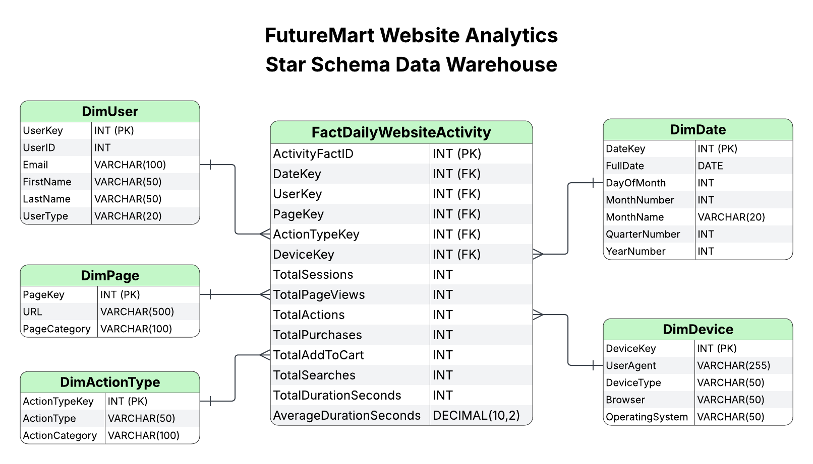
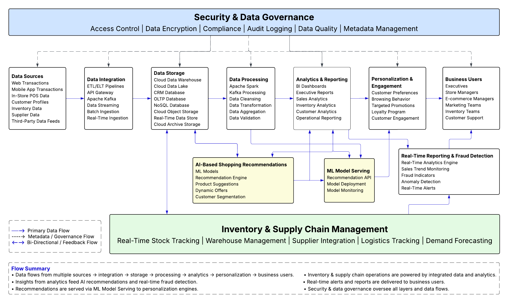

# Module 9 – Enterprise Data Architecture, Governance & Migration Strategy

## 📌 Module Overview

This module demonstrates enterprise data architecture assessment, target-state architecture design, data governance planning, and migration strategy development for a large-scale retail organization.

The module is based on a business case involving the merger of two retail companies, FashionMart and TrendyThreads, into a unified enterprise platform called FutureMart.

The project focuses on evaluating existing enterprise architectures, identifying strengths and improvement opportunities, designing a future-state architecture, establishing a governance framework, and defining data migration strategies.

---

## 🎯 Objectives

- Assess existing enterprise data architectures
- Identify strengths, weaknesses, and improvement opportunities
- Design a scalable future-state enterprise architecture
- Develop enterprise data governance policies and controls
- Define data migration strategies between systems
- Demonstrate enterprise architecture documentation and planning

---

## 🛠 Tools & Technologies

- Enterprise Data Architecture (EDA)
- Data Modeling
- PostgreSQL
- MySQL
- MongoDB
- Data Governance Frameworks
- Data Migration Strategies
- Lucidchart
- Architecture Diagrams
- Business Process Analysis

---

## 🏗 Enterprise Architecture Workflow

The project follows a structured enterprise architecture methodology:

- Assess current-state architectures
- Identify architectural gaps and risks
- Design FutureMart target-state architecture
- Define governance and compliance framework
- Develop migration strategy and implementation roadmap


## 📁 Module Structure

```
module_9_enterprise_architecture/

├── README.md                                          → Module documentation and architecture overview
│
├── current_state/
│   ├── FashionMart_Architecture_Assessment.pdf          → Current-state architecture assessment
│   ├── FashionMart_Architecture_Blueprint.png           → FashionMart architecture blueprint
│   ├── TrendyThreads_Architecture_Assessment.pdf        → Current-state architecture assessment
│   └── TrendyThreads_Architecture_Blueprint.png         → TrendyThreads architecture blueprint
│
├── future_state/
│   ├── FutureMart_Architecture_Assessment.pdf           → Enterprise architecture redesign assessment
│   ├── FutureMart_EDA_Blueprint.png                     → Future-state enterprise architecture blueprint
│   │
│   ├── operational_model/
│   │   ├── FutureMart_ERD.png                           → Operational enterprise data model
│   │   └── FutureMart_OLTP_Database_Schema.md           → Transactional OLTP schema
│   │
│   └── analytical_model/
│       ├── FutureMart_Website_Analytics_Star_Schema.png → Analytical data warehouse star schema
│       └── FutureMart_Website_Analytics_DWH_Schema.md   → Analytical star schema design
│
├── governance/
│   └── FutureMart_Data_Governance_Framework.pdf         → Enterprise governance framework
│
└── migration/
    ├── scripts/
    │   ├── rdbms2nosql.txt                              → Relational-to-NoSQL migration
    │   └── nosql2rdbms.txt                              → NoSQL-to-relational migration
    │
    ├── reports/
    │   └── mongodb_analysis_report.txt                  → MongoDB migration analysis
    │
    └── screenshots/
        ├── 01_mongodb_source_count.png                  → MongoDB source collection validation
        ├── 02_mongoimport_execution.png                 → MongoDB import execution
        ├── 03_mongodb_validation.png                    → MongoDB data validation
        ├── 04_mongodb_products_collection.png           → MongoDB products collection
        ├── 05_rdbms_to_nosql_report.png                 → Migration validation report
        ├── 06_mysql_table_creation.png                  → MySQL target schema creation
        └── 07_nosql_to_rdbms_report.png                 → Reverse migration validation
```

---

## 🧠 Architecture Transformation

```
       FashionMart
            ↓
   Architecture Assessment
            ↓
      TrendyThreads
            ↓
   Architecture Assessment
            ↓
       Gap Analysis
            ↓
FutureMart Enterprise Architecture
            ↓
    Governance Framework
            ↓
    Migration Strategy
```

---

## 📊 Current-State Architecture Assessment

The architectures of FashionMart and TrendyThreads were evaluated to identify:

- Existing data repositories
- Data integration approaches
- Security controls
- Governance practices
- Data quality processes
- Scalability limitations
- Areas for improvement

The findings were documented and used as inputs for the FutureMart target-state architecture design.

---

## 🏢 Future-State Enterprise Architecture

FutureMart was designed as a unified enterprise platform supporting:

### Data Repositories

- OLTP Databases
- Data Warehouse
- Data Lake
- NoSQL Repositories

### Data Integration

- Batch Processing
- ETL Pipelines
- API Integration
- CDC Workflows

### Analytics & Reporting

- Business Intelligence
- Reporting Platforms
- Data Science Workloads

### Security & Governance

- RBAC
- Encryption
- Compliance Controls
- Data Quality Monitoring

---

## 🔄 Data Migration Strategy

The migration component demonstrates bidirectional migration patterns between relational and NoSQL systems.

### Implemented Scenarios

- RDBMS → MongoDB migration
- MongoDB → RDBMS migration
- Schema transformation
- Data validation
- Migration verification

### Migration Technologies

- MySQL
- MongoDB
- JSON
- CSV
- mongoimport
- SQL

---

## 🔐 Data Governance Framework

The governance framework defines:

- Data ownership
- Data stewardship
- Security controls
- Compliance requirements
- Data classification
- Access management
- Retention policies
- Governance KPIs

---

## 📷 Architecture Artifacts

### FutureMart Operational Data Model


### FutureMart Analytical Data Model


### FutureMart Enterprise Architecture Blueprint


---

## ▶ Enterprise Architecture Process

1. Evaluate current-state architectures
2. Document strengths and improvement opportunities
3. Design FutureMart target-state architecture
4. Create enterprise data model
5. Develop governance framework
6. Define migration strategy
7. Validate architecture artifacts

---

## ✅ Module Outcome

- Enterprise architectures successfully evaluated
- Future-state architecture designed and documented
- Enterprise data model developed
- Governance framework established
- Migration strategies defined and validated
- Enterprise architecture planning and transformation capabilities demonstrated
